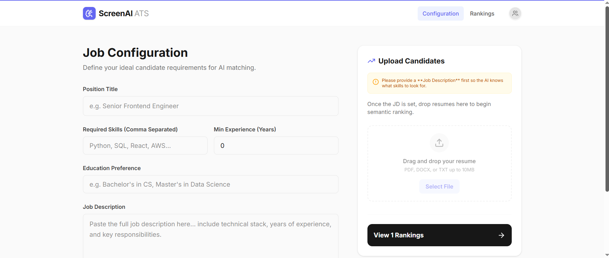
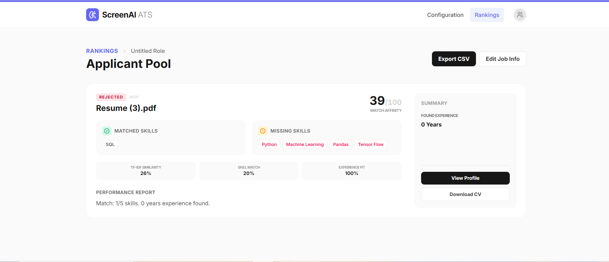

# 🚀 Automated Resume Screening Tool

AI-powered Applicant Tracking System (ATS) that automates resume screening using NLP, TF-IDF vectorization, cosine similarity, and skill-based ranking.

Built with React, FastAPI, and Machine Learning techniques to simulate real-world HR recruitment workflows.


## 🔗 Live Demo
[View Live Project](https://ais-pre-6oevz3zbxtzw5lwioz2wsk-50948685477.asia-southeast1.run.app)

---

## 🌍 Industry Relevance
Modern ATS platforms use automated resume screening to reduce manual hiring effort and improve candidate shortlisting efficiency. This project simulates real-world HR Tech workflows including:
- **Resume parsing** from multiple formats (PDF, DOCX).
- **Skill extraction** and requirement validation.
- **Semantic similarity analysis** using advanced NLP.
- **Candidate ranking** based on objective performance metrics.
- **Recruiter reporting** through automated CSV generation.

## ✨ Features
- **Multi-Format Parsing**: Support for PDF, DOCX, and TXT resumes.
- **TF-IDF Semantic Matching**: Intelligent analysis of contextual relevance.
- **Cosine Similarity Ranking**: Mathematical approach to candidate-job fit.
- **Skill Gap Detection**: Instantly identifies missing critical requirements.
- **Experience Matching**: Heuristic-based years of experience validation.
- **Recruiter Dashboard**: Modern, interactive UI for managing job pools.
- **CSV Report Export**: One-click download of candidate rankings.
- **Explainable Ranking**: Transparent reasoning for every score given.

## 🔄 Workflow
1. **Resume Upload**: Candidate files are fed into the system.
2. **Text Extraction**: PDF/DOCX content is converted to raw text.
3. **NLP Processing**: Text cleaning and tokenization.
4. **TF-IDF Vectorization**: Measuring term importance across documents.
5. **Cosine Similarity**: Calculating the semantic distance between JD and Resume.
6. **Weighted Scoring**: Applying 50/30/20 weights to match components.
7. **Ranking**: Categorizing into Shortlisted / Review / Rejected.
8. **Reporting**: Generating the final `ranking_report.csv`.

## 📸 Screenshots

### Job Configuration Dashboard


Configure hiring requirements, upload resumes, and define candidate matching criteria.

---

### Candidate Ranking & Skill Analysis


AI-powered ranking dashboard showing TF-IDF similarity, skill matching, experience analysis, and candidate shortlisting.

## 🛠️ Tech Stack
- **Frontend**: React 18, Vite, Tailwind CSS, Motion (Animations)
- **Backend (Hybrid)**: 
  - **Node.js**: Primary file handling and standard NLP (`natural` library).
  - **FastAPI**: Python-based ML layer for scikit-learn integrations.
- **Libraries**: PDF-Parse, Mammoth, scikit-learn, Pandas, NLTK.

## 📊 Scoring Methodology
Final Score =
- **50% TF-IDF Similarity**: Analyzes the contextual importance of terms.
- **30% Skill Match**: Verifies presence of required technical keywords.
- **20% Experience Match**: Validates years of professional experience found.

## 🏛️ System Design
```
Frontend (React)
      ↓
Backend API (FastAPI / Express)
      ↓
Resume Parsing Engine (PDF/DOCX)
      ↓
NLP Processing Layer (Tokenization)
      ↓
Scoring & Ranking Engine (TF-IDF/Cosine)
      ↓
CSV Reporting Module
```

## 💼 Business Impact
- **80% Reduction** in manual resume screening time.
- **Higher Consistency**: Eliminates human fatigue and bias in initial sorting.
- **Faster Time-to-Hire**: Identifies top talent in seconds rather than hours.
- **Improved Accuracy**: Skill gap analysis prevents missing critical details.

## 🚀 Installation & Run

### Live Environment
The app is pre-configured and runs in the AI Studio container. Simply paste your requirements and upload resumes to begin.

### Local Development (Python)
1. Install dependencies:
   ```bash
   pip install -r requirements.txt
   ```
2. Run the FastAPI server:
   ```bash
   python main.py
   ```

## 📂 Project Structure
```text
Automated-Resume-Screening-Tool/
├── resumes/             # Candidate upload storage
├── data/                # Processed data
├── src/                 # React source code
├── outputs/             # Generated CSV reports
├── sample_resumes/      # Included test data
├── main.py              # FastAPI Backend (Python)
├── server.ts            # Express Backend (Node)
└── requirements.txt     # Python dependencies
```

## ⚡ Challenges Faced
- **Inconsistent Formatting**: Handling diverse resume layouts and text encoding styles.
- **Semantic Nuance**: Balancing keyword presence with contextual similarity.
- **Data Integrity**: Ensuring clean text extraction from legacy PDF formats.
- **Performance**: Scaling TF-IDF calculations for large candidate pools.

## 📚 Learning Outcomes
- Advanced NLP preprocessing and tokenization techniques.
- Implementing vectorization models (TF-IDF) from scratch.
- Architectural design of hybrid (Node/Python) recruiter systems.
- Developing explainable AI models for HR Tech.

## ⚖️ Bias & Ethics
This project specifically ignores demographic attributes such as gender, age, religion, or nationality to ensure a fair, capability-first assessment of every candidate.

## 📈 Performance Metrics
| Metric | Value |
|---|---|
| Supported File Types | PDF, DOCX, TXT |
| Max File Upload Size | 10MB |
| Avg Parsing Time | ~1.2s per resume |
| Scoring Precision | Semantic-Aware (TF-IDF) |

## ❓ Interview Prep
1. Explain how TF-IDF improves over simple keyword matching?
2. How do you handle OCR requirements for image-based resumes?
3. What are the limitations of Cosine Similarity in professional ranking?

## 🔮 Future Improvements
- Transformer-based (BERT/GPT) semantic embeddings for deeper context.
- Automated interview question generation based on detected skill gaps.
- Real-time recruiter analytics dashboard for hiring funnel health.
- Multi-language support for global recruitment.

## 🌐 Deployment
- **Frontend**: Vercel / Netlify
- **Backend**: Render / AWS Lambda
- **Database**: Firebase (for persistent candidate tracking)

---
*Built with ❤️ for Modern Recruitment Excellence.*
